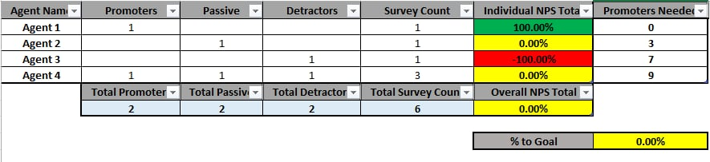

Welcome to my professional portfolio—where data, process, and automation meet clarity.
# Hi, I'm Jullmar 👋  
**Operations Analyst | Excel & Automation Enthusiast**

📧 [j.tolentino2k20@gmail.com](mailto:j.tolentino2k20@gmail.com)  
📱 +63 976 375 6724  
🔗 [LinkedIn](https://www.linkedin.com/in/jullmar-tolentino/)

---

### 🏁 Welcome  
Welcome to my professional portfolio—where **data, process, and automation meet clarity**.  
I’m an operations professional passionate about turning messy workflows into clean, data-driven systems.  
I specialize in **Excel**, **Google Sheets**, and **AI-assisted tools** to automate reporting, streamline visibility, and drive better team performance.  
I believe dashboards should *explain themselves*—fast, accurate, and actionable.

---

### 🧠 Key Skills
- Excel Reporting & Dashboard Creation  
- Data Cleaning & KPI Tracking  
- AI-Assisted Problem Solving *(ChatGPT, Copilot, Gemini)*  
- Process Analysis & Workflow Improvement  
- Collaboration & Stakeholder Communication  
- Google Sheets Integration  

---

### 📊 Featured Project: Team Performance Tracker (NPS Dashboard)
**Context:**  
Our team struggled with declining NPS scores caused by high call volumes and limited meeting time.  
Visibility into real-time performance was poor.  

**Action:**  
- Self-taught Excel reporting concepts using AI tools like ChatGPT, Copilot, and Gemini.  
- Built a **simplified NPS dashboard** showing team and individual standings in real time.  
- Deployed updates through chat integration with supervisor approval to maintain visibility and accountability.  

**Impact:**  
- Removed the need for frequent sync meetings.  
- Empowered agents with self-service performance tracking.  
- Contributed to **top performance rankings** for seven consecutive months.  

🔗 *Sample dashboard structure available upon request.*

---

### 🧰 Tools & Tech  
  
  
  
  
  

---

### 📸 Preview  

*(All data shown is mock/sample data for demonstration purposes.)*

---

⭐ *Continuous learner. Data enthusiast. Always experimenting with new ways to make work faster, clearer, and smarter.*
